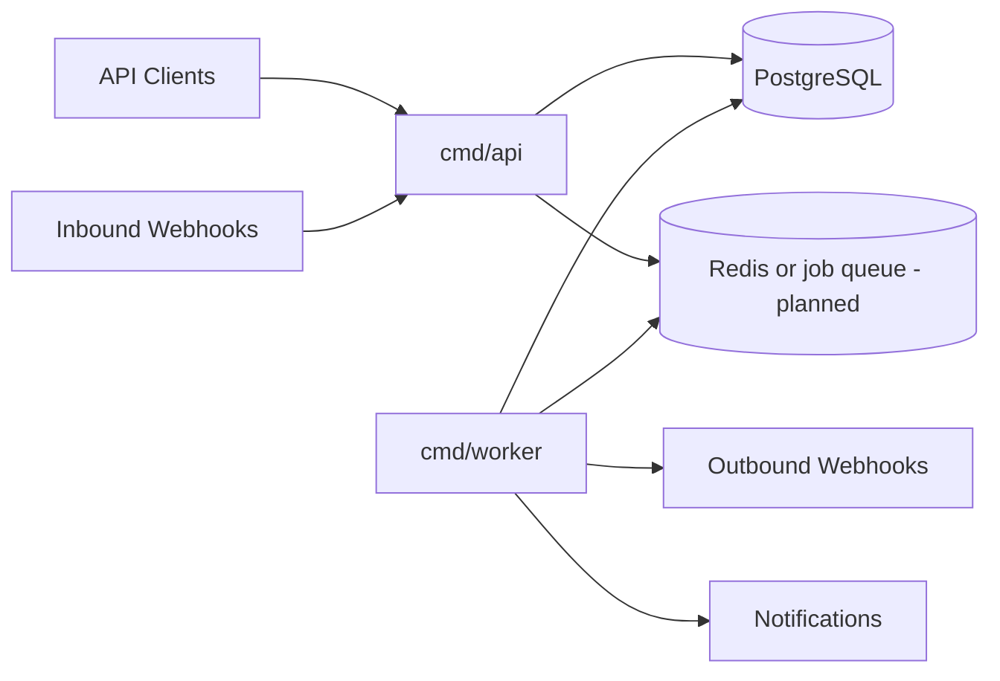

# GoTicket

GoTicket is planned as a production-oriented backend for ticket and support workflows, including multiple ingestion methods, asynchronous notifications, automation, SLA handling, outbound webhooks, and auditability.

This repository currently contains the initial project foundation and core domain model. Ticketing behavior outside the domain layer has not been implemented yet.

## Goals

- Build a maintainable support-ticket backend around clear domain packages.
- Demonstrate idiomatic Go API, worker, persistence, observability, and background-processing patterns.
- Explore reliable webhook ingestion and notification delivery with idempotency, retries, and audit history.
- Keep the first version focused on backend correctness rather than UI breadth.

## Planned Features

- Ticket CRUD.
- Multiple inbound ticket sources.
- Generic webhook ingestion.
- Email-provider webhook ingestion later.
- Internal and public comments.
- Assignment, tags, priority, and custom fields.
- SLA tracking.
- Notification queues.
- Outbound webhooks with signing.
- Retry policies, exponential backoff, and dead-letter handling.
- Idempotency for inbound and outbound workflows.
- Ticket merging.
- Audit history.
- Automation and routing rules.

## Architecture

The intended architecture has an API process for synchronous request handling and a worker process for asynchronous jobs. Domain packages own ticketing, ingestion, notification, SLA, automation, and webhook behavior. Storage and observability packages provide shared infrastructure without becoming global business-logic layers.

## Repository Structure

- `cmd/api` - planned HTTP API entry point.
- `cmd/worker` - planned background worker entry point.
- `internal/domain` - core ticket, user, organization, and comment entities plus repository contracts.
- `internal/ticket` - planned ticket application behavior.
- `internal/ingest` - inbound source handling.
- `internal/webhook` - webhook signing, dispatch, and receipt concepts.
- `internal/notification` - planned notification queue and delivery behavior.
- `internal/automation` - planned routing and automation rules.
- `internal/sla` - SLA policy and tracking behavior.
- `internal/storage` - database access boundaries.
- `internal/observability` - logging, tracing, and metrics setup.
- `api/openapi` - future API specifications.
- `docs` - architecture and event documentation.

## Technology Stack

- Go - primary language.
- Chi or another lightweight router - planned.
- pgx - planned PostgreSQL access.
- PostgreSQL - planned persistence layer.
- Redis - planned only where it clearly supports queues or coordination.
- OpenTelemetry - planned observability.
- REST API - planned public interface.

Only the module and directory skeleton are currently present.

## Development

Setup instructions will be expanded as implementation begins. No generated dependencies, lockfiles, or framework boilerplate are present yet.

## Roadmap

- [x] Define ticket, user, organization, and comment domain models.
- [ ] Establish HTTP API routing and validation.
- [ ] Add PostgreSQL migrations and storage interfaces.
- [ ] Implement inbound webhook ingestion with idempotency.
- [ ] Add worker-driven notification delivery.
- [ ] Add outbound webhook signing and retry handling.
- [ ] Add SLA tracking and automation rules.
- [ ] Publish OpenAPI documentation.

## License

MIT. See `LICENSE`.

GoTicket is under active development.
